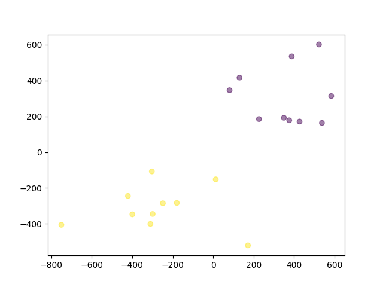

# VU ACCE Course - Group Project 2

## Assignment Description

The goal of this assignment is to implement the K-Means clustering algorithm with Vitis HLS.
The algorithm logic remains the same as in the previous assignment. We restate the key details below (section "The Algorithm") for completeness.

This assignment is split into two parts: 
1. Base Implementation: you have to port the original CPU-based algorithm to Vitis HLS, verify correctness, and analyze the synthesis results.
2. Optimized Implementation (optional, but required for higher grades): improve the performance achieved by the base implementation using performance optimization techniques.


### Base implementation
In this first part, you are asked to port the original CPU-based implementation to Vitis HLS. 
This would require you to:
- Remove unsupported C/C++ constructs (e.g., `malloc` is not synthesizable in Vitis HLS, while `memset` is), and avoid using pointers in top-level function struct arguments.
- Properly define the interfaces of the top-level function.
- Make sure that the corresponding implementation is correct in both C Simulation and RTL Co-Simulation:
  - For Co-Simulation, we suggest you use small input datasets (for correctness checks these are `input2D_2clusters.in` and `input2D_10clusters.in`) and limit the number of iterations to 10. This keeps c0-simulation time reasonable (~2 minutes for `input2D_2clusters.in`, and ~30 minutes for `input2D_10clusters.in`) 
- Analyze the performance inspecting the produced synthesis report and the log file (with the default configuration provided with this assignment, you will find it under `KMEANS_HLS_base/solution_KMEANS_HLS_base/solution_KMEANS_HLS_base.log `). To make sense of it, you must:
  - Provide the synthesizer with hints about the number of iterations of loops. For this, we suggest you: a) explicitly set variables relevant for the number of loop iterations to constant (e.g., number of clusters, dimension, ...). **Be aware:** this is just for the sake of synthesis, and depends on the particular dataset you are using; b) use `#pragma HLS loop_tripcount`.
  - Reason about the performance of the various loops in the top function. We suggest you to properly label them to spot them in the report. Aspects to discuss include (but are not limited to): *Are the loops pipelined? What is the achieved Initiation Interval (II)? Why is the II not equal to 1, if that's the case?*
  
  - **Note**: by default, the provided TCL script disable automatic compiler optimization such as pipelining (`config_compile` flag). For the sake of the analysis, we ask you to report your findings **without and with** such compiler optimization. 


You will find more details on the files and directory organization under the Structure section.

### Optimized Implementation

After you complete the first step, you should have gained knowledge on some of the issues or limitations of the base implementation.
In this optional (but recommended) part, you have the freedom to optimize your implementation, using some of the techniques we discussed in class, or other you can find in the Vitis documentation.

Your implementation must be written in the `KMEANS_HLS_optimized.cpp`, `test_KMEANS_HLS_optimized.cpp`, and `run_KMEANS_HLS_optimized.tcl` files. By default they have the same content of the `_base` files.

As in the previous step, we require you to:
- Ensure functional correctness.
- Analyze performance improvements and describe what changes you made, why they improved performance, and  which techniques were applied (e.g., loop unrolling, array partitioning, dataflow pipelining, etc.).


### The Algorithm

Note: this section is identical to the corresponding one of the GPU assignment.

The K-means clustering algorithm is an unsupervised clustering method used to classify a dataset into $K$ different clusters, where the number of clusters $K$ is known beforehand.
Given a cloud of $m$ points P = $( x_1, x_2 , ...,  x_m )$, where each point has $n$ dimensions $x_i = (x_{i,1}, x_{i,2}, ... ,x_{i,n})$, the K-means algorithm assigns each point to a specific cluster in $(c_1, c_2, ... , c_K)$, whose centroid is the nearest (i.e. the distance between the cluster centroid and the point is at the minimum Euclidean
distance). See more details on the [Wikipedia page](https://en.wikipedia.org/wiki/K-means_clustering), and use the sequential code as a reference to study.

The algorithm works as follows:

1. Select K random centroids $(ce_1, ce_2,... , ce_K)$, one for each cluster.
2. Assign each point to the nearest centroid (minimum Euclidean distance).
3. Recompute the centroids of each cluster as the mean of the data points assigned to that
cluster
1. Repeat steps 2 and 3 until one of the following conditions is satisfied:
    * The centroids do not change significantly, i.e., between one iteration and the previous one, the maximum movement of all centroids within each cluster is less than a given threshold
    * The number of data point changes from one cluster to another between one iteration and the previous one is less than a given threshold 
    * A maximum number of iterations is reached

We want you to implement a K-Means clustering algorithm with Vitis HLS. We suggest you not change this algorithm in your code. There might be floating point errors if you parallelize the algorithm in different ways, but the workflow should be (mathematically) the same.

## Structure
The structure of this project template is as follows.

The `cpu_impl` folder contains the CPU sequential reference implementation. In addition, there is a slurm job script for generating reference output files with pre-defined maximum iterations. 

In the top folder of this assignment you will find:
- the `KMEANS_HLS_base.cpp`, almost 1:1 copy of the sequential code. The `do_compute` is assumed to be top function.
- the `KMEANS.h` header, containing data type definition.
- the testbench file `test_KMEANS_base.cpp` (that is in charge of loading input files, writing result, and invoke the top function).
- the TCL script `run_KMEANS_HLS_base.tcl`, that contains the commands to setup a project, running C-Simulation, Synthesis and Co-Simulation
- corresponding files for the optimized version of the code (second step of the assignment): `KMEANS_HLS_optimized.cpp`, `test_KMEANS_HLS_optimized.cpp`, and `run_KMEANS_HLS_optimized.tcl`. By default, they have the same content of the `_base` files.

You need to port the K-Means to Vitis HLS. You are allowed to change the provided files as you wish.
**Important:** In your submission, have TCL scripts and all required files in a good state to test your code. We will use them to validate your code (so they must work out of the box).

### Input
The `test_files` folder contains a few test data examples. 
An input file starts with 2 integers `npoints` and `ndims` in the first line, representing the number of data points and the dimensions of each point respectively. Then it is followed by `npoints` lines, one for each data point in the cloud of points to be classified, with each dimension (a single precision floating point number) of the points separated by spaces. 

See `test_files/input2D_2clusters.in`, a small data file with 20 points and 2 dimensions. The 2D points are generated with 2 pre-defined cluster centroids:



You can generate your own input files for your experiment design using the `test_files/datagen.py` Python script template provided.


### Output

The output file contains `npoints` lines, with a single integer in each line. The integer $c_i$ in the $i$-th line represents the cluster ID of the $i$-th point (correspondingly, the $(i+1)$-th line in the input file), with $1 \le c_i \le K$. The cluster IDs start from 1. A possible output file for `test_files/input2D_2clusters.in` is `test_files/2D_2clusters_10iter.out`, where `10iter` means the pre-defined maximum iteration is 10. 

Under `test_files` you will find some pre-generated reference output files. These are for the input files that specify the number of clusters in their name (e.g., `input2D_2clusters.in`) and will be used for correctness check (see later). 
We generated the reference output with the CPU sequential code and max. 10 iterations:

```bash
prun -np 1 ./KMEANS_seq ./test_files/input<ndim>D_<K>clusters.in <K> 10 0 0 ./test_files/<ndim>D_<K>clusters.out
```

Also, in the standard output, you can also see the log info for the number of cluster changes & centroid distance per iteration (the 3 terminate conditions in the algorithm step 4). In the iteration `it`, the out format is as follows:
```
[<it>] Cluster changes: <changes>        Max. centroid distance: <maxDist>
```

This output is handled in the `KMEANS.c` file and you just need to store the 3 required numbers into the result after each iteration (see line 108 in `KMEANS_seq.c`):

```C
r->outputMsg[it - 1] = (struct message) { it, changes, maxDist };
```

### Execution
You can run the sequential code with the following command:

```bash
sbatch ./cpu_impl/job.sh
```

the job script contains the compilation and 4 executions with dfferent input data files with the usage of:

```bash
./cpu_impl/KMEANS_seq <input data file> <number of clusters> <maximum number of iterations> <Minimum percentage of class changes> <Precision in the centroid distance> <output file>
```

To run the HLS implementation you can use the provided TCL script

```bash
vitis_hls -f run_KMEANS_HLS_base.tcl
```

or the job script:
```bash
sbatch job_base.sh
```

**Important:**
- Inspect the content of the TCL script. By default, it executes the full flow: C Simulation, Synthesis, and RTL Co-Simulation.
- If you wish to change the input dataset or skip specific steps, you must **manually edit the TCL script accordingly**.
- Our suggestion is that you start by verifying the result of the C Simulation, as this step is faster and helps catch early functional errors before proceeding to RTL Co-Simulation.
- Synthesis is a stochastic process: its results may vary depending on the compute node used. To ensure reproducibility, always run synthesis on the same compute node and **mention it in your report**.


### Correctness
The provided input data files ending with the number of clusters and maximum number of iterations are generated with pre-defined clusters and normal distribution points. 
We will check the correctness with the 4 given input files (`input2D_2clusters.in`, `input2D_10clusters.in`, `input10D_10clusters.in`, and `input100D_300clusters.in`) **using 10 iterations** and compare with the given respective output files. For all of them, we will check the result of C-simulation, and for the first two (the smaller ones), also the results of Co-Simulation. For example, if you want to test the correctness of your base implementation with the file `input2D_10clusters.in`:

```bash
sbatch job_base.sh

# Wait for the job completion ...

# Evaluate correctness of the C-Simulation output
diff ./KMEANS_HLS_base/solution_KMEANS_HLS_base/csim/build/2D_10clusters.out ./test_files/2D_10clusters_10iter.out

# Valuate correctness of the RTL Co-simulation output
diff ./KMEANS_HLS_base/solution_KMEANS_HLS_base/sim/wrapc_pc/2D_10clusters.out test_files/2D_10clusters_10iter.out
```

**Note:** to enable RTL Co-Simulation, you have to properly define the interfaces of the top-function, including their depth.

See the script `test_files/datagen.py` to understand how these input data files are generated and the Output section for the running arguments to get the reference output file.

Since we are using single-precision numbers, testing with differently generate data, larger dimensions, or point counts may result in slight accuracy discrepancies between the CPU and FPGA. **This is why we suggest you limit your correctness check to small input files, or the four mentioned above.**

We will check that your HLS implementation passes the csim, csynth and cosim stages as described before.

### Performance
Provided that your code is correct (as defined above), the quality of your solution is evaluated by the latency, resource consumption, and synthesis frequency (Fmax) reported after the synthesis step (`csynth`). You can find this information in the report generated by the synthesis process (e.g., under `KMEANS_HLS_base/solution_KMEANS_HLS_base/syn/report`).

